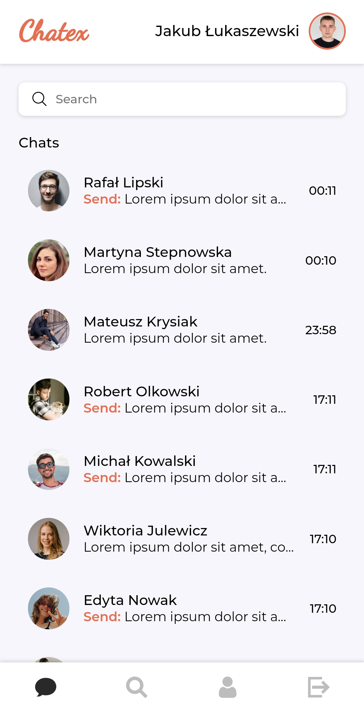
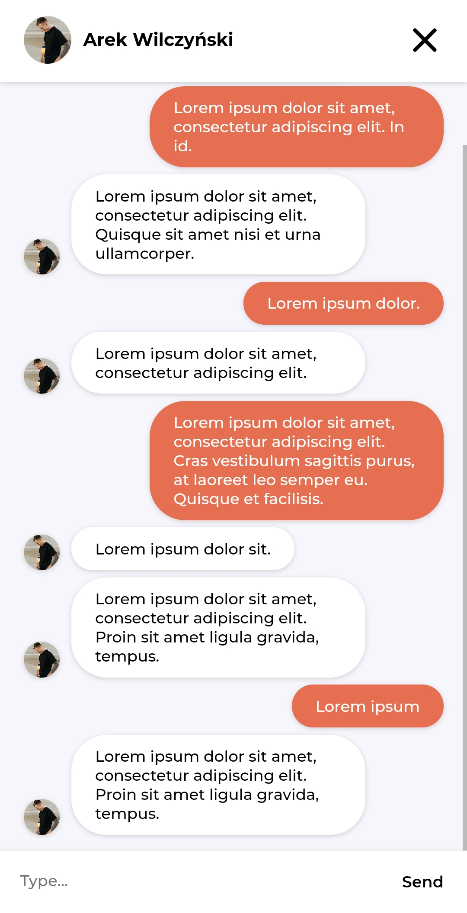

# Chatex - realtime chat app.

Chatex is an application for exchanging messages between users in real time. Built in React with Firebase as serverless backend

## Live Preview

LIVE: www.chatex.jakublukaszewski.pl

## Screenshots




## Instalation

```
git clone https://github.com/JakubLukasz/Chatex
cd Chatex
npm install
// Add your .env file with firebase settings
npm start     // for developing server
npm run build     // for build file
```

## Technologies

Project is created with:

- React: 17.0.2
- Firebase: 8.8.1
- React-router-dom: 5.2.1
- React-hook-form: 7.14.0
- React-inlinesvg: 2.3.0
- Styled-components: 5.3.0
